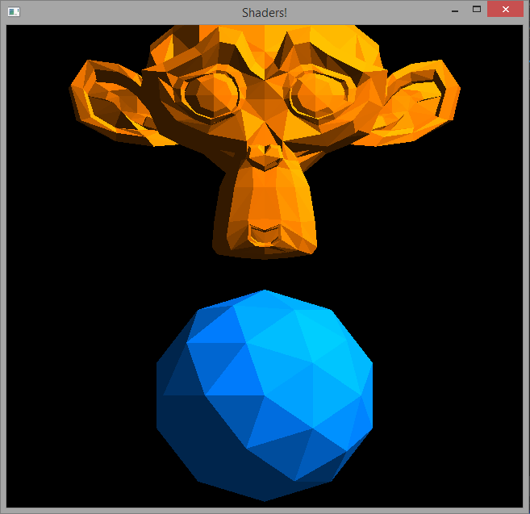

# Rrenderer

_Small simplistic render engine to get my hands dirty with OpenGL_

### How to use

* Open the solution in Visual Studio
* Link OpenGL, GLFW and GLEW correctly on your system
* Build as Win32

### Screenshot(s)

